<h3><code>shiv@github ~ $ ./contributions.sh</code></h3>

  

<h3><code>shiv@github ~ $ whoami</code></h3>
<table>
  <tr>
    <td valign="top"></td>
    <td valign="top"></td>
  </tr>
</table>

 

 

<h3><code>shiv@github ~ $ ls projects/</code></h3>

| Project | Description | Stack |
| --- | --- | --- |
| 🌐 [HOLO✦PAD](https://github.com/shiv0xparanoid/HOLOPAD) | Browser-native 3D spatial creation platform: voxel editor + hologram pipeline | JavaScript · Three.js · WebGL |
| ⚛️ QVANTA | Interactive quantum computing learning platform for SIH 2026: 3D circuit builder + AI tutor | React · Three.js/R3F · FastAPI · Qiskit |
| 🎨 [Sketchify](https://github.com/shiv0xparanoid/sketchify) | AI-powered hand-drawn sketch generator | Python · PyTorch · SAM/U-2-Net |
| 🤖 Samvaad *(in progress)* | Mental health chatbot for introverts using RAG + BERT | Python · Flask |
| 📐 Equation Art *(exploring)* | Real-time visual art generated from mathematical equations | JavaScript · WebGL · Math.js |
| 🔮 Kundli GPT | Vedic astrology prompt system + chatbot | React |

*🐙 coding is for fun*

